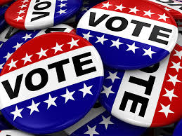

# Overview of Election Audit: 

## Description:

The analysis consists in reporting the total number of votes cast, the total number of votes for each candidate, the percentage of votes for each candidate, and the winner of the election based on the popular vote.

## Purpose: 

This report is done with the purpose of assiting the Colorado Board of Elections in the election audit for the US congressional prescient in Colorado. 

## Overview of Approach: 

There are several voting methods taken into account: Mail-in Ballot, punch cards, and direct recording electronic.  These three methods will determine the final election results. After the votes are counted, this audit generates a vote count report to certify this US congressional race.

This process could be done using excel but will be automated using Python, we used VS Code as a tool to write and run the code. The code is in the file named "PyPoll_Challenge.py", the data for the analysis is in the Resources folder and it is a csv file named "election_results.csv" and contains aproximately 370,000 rows. 

## Election-Audit Results:                                 
  
* 369,711 votes were cast in this congressional election.  

* The following are the Votes and percentages for each county in the precint: Jefferson: 10.5% (38,855), Denver: 82.8% (306,055), and Arapahoe: 6.7% (24,801).

* Denver was the county with the largest number of votes.

* Here is the breakdown of the number of votes and the percentage of the total votes each candidate received: Charles Casper Stockham: 23.0% (85,213), Diana      DeGette: 73.8% (272,892), Raymon Anthony Doane: 3.1% (11,606).

* **Diana DeGette won the elections** with a vote count of (272,892), representing a  73.8%  of the total votes.

## Election-Audit Summary: 

This analysis could have been done using excel but we prefered to automate the process using Python.  The reason why we used Python is because we want to save time in future analysis of this same nature.

We propose to the Election Comission that the code writen here can be re-used at other congressional districts, senatorial districts, and local elections.
